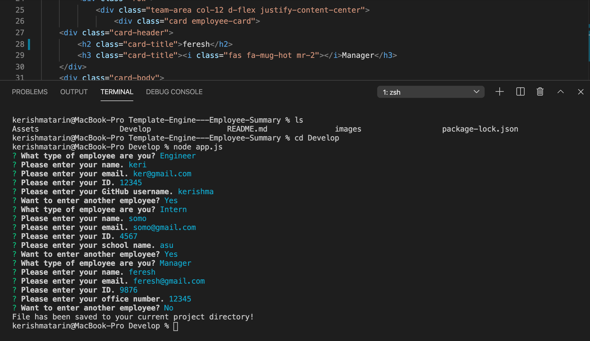

# Unit 10 OOP Homework: Template Engine - Employee Summary

Build a Node CLI that takes in information about employees and generates an HTML webpage that displays summaries for each person.


## Instructions
```
As a manager
I want to generate a webpage that displays my team's basic info
so that I have quick access to emails and GitHub profiles
```
1. Install npm i
2. Install npm i Inquirer
3. use node.js
4. App runs in Node 
5. Run tests
6. Create or update classes to pass a single test case
7. Repeat

## Minimum Requirements

* Functional application.

* GitHub repository with a unique name and a README describing the project.

* User can use the CLI to generate an HTML page that displays information about their team.

* All tests must pass.

### Classes
The project must have the these classes: `Employee`, `Manager`, `Engineer`,
`Intern`. The tests for these classes in the `tests` directory must all pass.

The first class is an `Employee` parent class with the following properties and
methods:

  * name
  * id
  * email
  * getName()
  * getId()
  * getEmail()
  * getRole() // Returns 'Employee'

### User input

The project prompt the user to build an engineering team. Engineering
team consists of a manager, and any number of engineers and interns.

### Roster output

The project generate a `team.html` page in the `output` directory, that displays a nicely formatted team roster. Each team member display the following in no particular order:

  * Name

  * Role

  * ID

  * Role-specific property (School, link to GitHub profile, or office number)

### Deployed link


### image



### Gif Demo

https://github.com/kerishma/Template-Engine---Employee-Summary/blob/master/Untitled_%20Aug%2013%2C%202020%201_23%20PM.gif

### Owner

Kerishma Tarin
